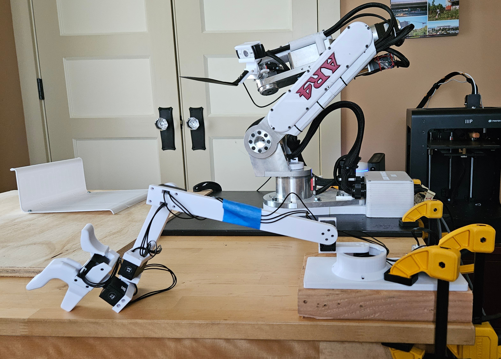

# Annin AR4

GELLO parts for the AR4 series of robotic arms by [Annin Robotics](https://www.anninrobotics.com/).

## BOM

- DYNAMIXEL XL330-M288-T x6 https://www.robotis.us/dynamixel-xl330-m288-t/ 
- DYNAMIXEL XL330-M077-T x1 https://www.robotis.us/dynamixel-xl330-m077-t/ 
- FPX330-H101 x1 https://www.robotis.us/fpx330-h101-4pcs-set/ 
- U2D2 Power Hub Board Set x1https://www.robotis.us/u2d2-power-hub-board-set/ 
- Power Supply x1 https://www.amazon.com/dp/B078RT3ZPS
- Springs (Gripper) x1 https://www.amazon.com/gp/product/B005XQKG4Q

## 3D-printed parts

- [base.stl](3dprint_parts/base.stl)
- [ring.stl](3dprint_parts/ring.stl)
- [l1.stl](3dprint_parts/l1.stl)
- [arm1.stl](3dprint_parts/arm1.stl)
- [arm2.stl](3dprint_parts/arm2.stl)
- [wrist.stl](3dprint_parts/wrist.stl)

