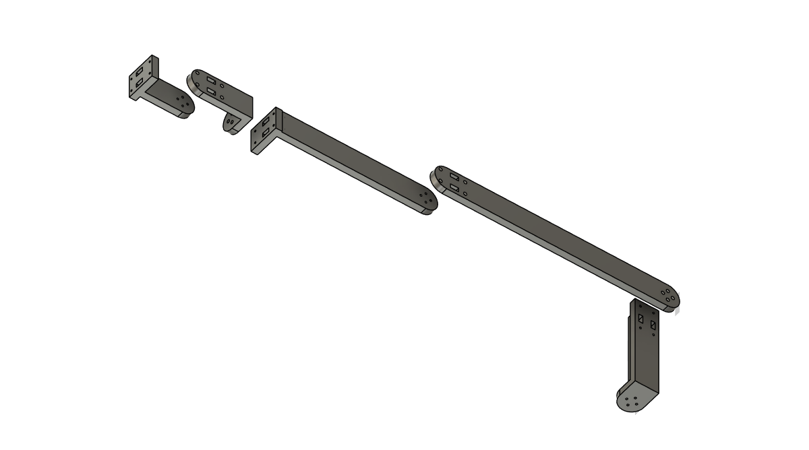

# FANUC CRX-10/12A

GELLO leader-arm parts for the FANUC CRX-10/12A collaborative robot, derived
from the UR5 GELLO in this repository.

The whole model is generated by [`gello_crx10_12a_fusion.py`](gello_crx10_12a_fusion.py),
a parametric Autodesk Fusion script. `ALPHA` at the top of that file is the
link-length coefficient; everything else follows from it.

## Link lengths

Link lengths are the real CRX-10/12A link lengths multiplied by **α = 0.5**.
Everything that touches hardware — DYNAMIXEL body, horn, screw pattern, plate
thickness, link width — stays 1:1. This is the same convention the UR5 GELLO
uses (its links are exactly 0.5x the real UR5) and the same one
[`../ar4/gello-ar4.scad`](../ar4/gello-ar4.scad) expresses as `scale_factor`.

| | real CRX-10/12A | α = 0.5 |
|---|---|---|
| base mounting face → J2 axis | 245 mm | **122.5 mm** |
| J2 → J3 (upper arm) | 540 mm | **270 mm** |
| J3 → J5 wrist centre (forearm) | 540 mm | **270 mm** |
| J5 → J6 faceplate | 160 mm | **80 mm** |
| J1 ↔ J2 offset | 0 | 0 |

Dimensions were read off the FANUC CRX-10/12A general-arrangement drawing
(`2D_CRX10-12A_v01.dxf`, 1:1, mm). The motion-envelope circles Ø2498 and Ø2160
are concentric on the J2 axis, and Ø2160 / 2 = 1080 = 540 + 540 confirms both
arm segments and a zero J1↔J2 offset. The vendor CAD is not redistributed here.

Resulting leader-arm reach is 624.5 mm from the J2 axis, about 40 % longer than
the UR5 GELLO. If that is too large for your workspace, lower `ALPHA` and
regenerate.

## Joint topology — read this before comparing with the UR5

The CRX-10/12A is a conventional 6R arm: **J4 is a roll about the forearm.**
The UR5 has a pitch there instead. A GELLO only works if it is joint-for-joint
identical to the follower, so L3, L4 and L5 are new geometry rather than
rescaled UR5 wrist parts. Only `base.STL`, the DYNAMIXEL interface and the
overall part style come from the UR5.

| joint | axis (home pose) | motor carried by |
|---|---|---|
| J1 | vertical | `base` |
| J2 | pitch | `L1` |
| J3 | pitch | `L2` |
| J4 | **roll along the forearm** | `L3` |
| J5 | pitch | `L4` |
| J6 | roll | `L5` |

The same topology is already implemented for the Annin AR4 in
[`../ar4/gello-ar4.scad`](../ar4/gello-ar4.scad), which is where the DYNAMIXEL
mount geometry in this model comes from.

## BOM

- DYNAMIXEL XL330-M288-T x6 — https://www.robotis.us/dynamixel-xl330-m288-t/
- DYNAMIXEL XL330-M077-T x1 (gripper) — https://www.robotis.us/dynamixel-xl330-m077-t/
- FPX330-H101 x1 (horn set) — https://www.robotis.us/fpx330-h101-4pcs-set/
- U2D2 Power Hub Board Set x1 — https://www.robotis.us/u2d2-power-hub-board-set/
- Power supply x1
- Spring for the gripper trigger x1
- M2 screws (the XL330 and FPX330 kits cover most of them)

## 3D printed parts

- [base.STL](base.STL) — identical to [../ur5/base.STL](../ur5/base.STL)
- [L1.STL](L1.STL)
- [L2.STL](L2.STL)
- [L3.STL](L3.STL)
- [L4.STL](L4.STL)
- [L5.STL](L5.STL)

Plus the shared gripper, which bolts to the J6 horn:
[../gripper/handle.STL](../gripper/handle.STL) and
[../gripper/trigger.STL](../gripper/trigger.STL).

Total printed volume is about 205 cm³ (~250 g in PLA).

## Assembly notes

- Build the chain from the base outwards: `base` → J1 motor → `L1` → J2 motor →
  `L2` → J3 motor → `L3` → J4 motor → `L4` → J5 motor → `L5` → J6 motor →
  gripper handle.
- Every joint uses the same interface: the motor bolts into the pocket of the
  part that carries it through four M2 screws on a 16 x 30 mm pattern, and the
  next part bolts to the horn through four M2 screws on a 6 mm radius. The 4 mm
  counterbores take the screw heads; the 2.35 mm holes are self-tapping into
  the print.
- `L1` is a 114 mm tall column, considerably taller than the UR5 L1, because
  the CRX puts J2 245 mm above the mounting face. Print it standing with the
  sole plate on the bed and use enough perimeters — it carries the whole arm.
- The reused UR5 base plate keeps its support-ring bolt pattern (four holes on
  a 36 mm radius). `L1` does not need a ring — its J1 interface is exactly the
  UR5 L1 interface — but [../ar4/ur5_support_ring.stl](../ar4/ur5_support_ring.stl)
  can be fitted if you want extra support under the taller column.
- Assign the motor IDs 1..6 from base to gripper with
  [DYNAMIXEL Wizard 2.0](https://emanual.robotis.com/docs/en/software/dynamixel/dynamixel_wizard2/#id-inspection).

## Regenerating the STLs

Open Fusion, run `Utilities > Add-Ins > Scripts and Add-Ins`, add
`gello_crx10_12a_fusion.py`, and run it. It creates a new design and writes
`L1.STL` .. `L5.STL` next to the script. `base.STL` is not generated — it is a
copy of the UR5 base plate.

To change the scale, edit `ALPHA` and re-run. The script asserts that the
chosen α still leaves room for the motors. Hardware-driven distances (plate
thickness, link width, the 60 mm from the J4 horn back to the wrist centre)
deliberately do not scale.

`gello_crx10_12a.step` is the α = 0.5 assembly in a neutral CAD format.

## Coordinate frame

The STLs are exported in assembly coordinates, the same convention as the UR5
GELLO STLs: **Y up (the J1 axis), Z along the arm, X along the pitch axes**,
origin on the J1 axis at the top face of the base plate, arm stretched
horizontally along +Z. Slice them in whatever orientation prints best; nothing
in the files assumes a print orientation.
