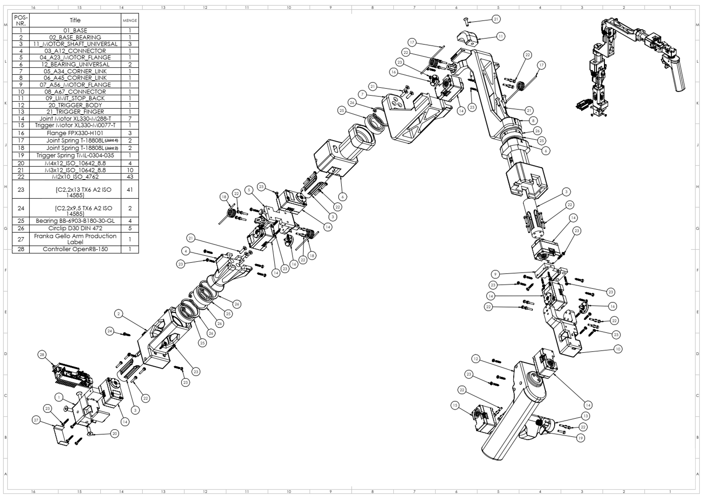

# GELLO for Franka FR3 and FR3 Duo - Assembly Overview

This subfolder contains the 3D-printable parts (STLs) for the **Franka GELLO** and **Franka GELLO Duo**, which are compatible with the Franka FR3 and Franka FR3 Duo robot systems.

This document provides a **high-level assembly overview** describing the structure, topology, and constraints of the system.  
It intentionally avoids detailed, step-by-step instructions.

*Exploded view showing the relationship between individual printed parts, joints, and the base structure.*

---

## What’s Included

- STL files for all structural Franka GELLO arm components
- Bases for single-arm and dual-arm configurations

> ⚠️ Hardware components (actuators, fasteners, bearings, electronics, cabling) are listed in the exploded drawing and must be sourced separately.

---

## Base Variants

The Franka GELLO system supports two base configurations:

### Single Base
- Designed to mount the **Franka GELLO** in a single arm configuration
- Used for standalone or single-robot setups

### Duo Base (FR3 Duo)
- Designed specifically for **FR3 Duo** configurations
- Hosts **two Franka GELLO arms** in a fixed arrangement
- The relative pose between both arms is defined by the base geometry

---

## Assembly Instructions

### Franka GELLO (Single Arm)

**Required 3D printed parts**
- 1x `00_TABLE_BASE_MOUNT_SINGLE.STL`
- 1x `01_BASE.STL`
- 1x `02_BASE_BEARING.STL`
- 1x `03_A12_CONNECTOR.STL`
- 1x `04_A23_MOTOR_FLANGE.STL`
- 1x `05_A34_CORNER_LINK.STL`
- 1x `06_A45_CORNER_LINK.STL`
- 1x `07_A56_MOTOR_FLANGE.STL`
- 1x `08_A67_CONNECTOR.STL`
- 1x `09_LIMIT_STOP_BACK.STL`
- 3x `11_MOTOR_SHAFT_UNIVERSAL.STL`
- 2x `12_BEARING_UNIVERSAL.STL`
- 1x `20_TRIGGER_BODY.STL`
- 1x `21_TRIGGER_FINGER.STL`
- 1x `23_TRIGGER_STORAGE_45.STL`

**Assembly steps:**
1. Build up the arm stack on the base (segments `01` through `09`), following the joint order from base to tip shown in the picture above.

   > **Motor direction:** The motors of joints 2, 4, and 6 can be mounted in two directions. This affects the [`joint_signs` parameter of the publisher configuration](https://github.com/wuphilipp/gello_software/blob/main/ros2/README.md#step-2-configure-the-assembly-offsets-of-your-gello). Check the exact motor direction in the exploded view to get the same value as the default configuration.

   > **Motor flange orientation:** Each motor flange allows for 4 possible mounting orientations. This affects the [`assembly_offsets` and `gripper_range_rad` parameters of the publisher configuration](https://github.com/wuphilipp/gello_software/blob/main/ros2/README.md#step-2-configure-the-assembly-offsets-of-your-gello). As described in the publisher's README, use the provided script to determine the values for your specific assembly. When assembling multiple GELLO arms, we recommend to choose the flange orientation consistently.

   > **Thread preparation:** Several attachment points in the 3D-printed parts require threads that are not self-tapping. You must **cut the threads by hand** (e.g., with an M2 or M3 tap, depending on the joint) before inserting screws. Do not force screws into unthreaded holes — this will crack the print.

   > **Cable lengths:** Cable lengths between joints vary along the arm. For the connections between joints 2-3, 5-6, 6-7, 7-8, and to the OpenRB-150, the default cables of 180mm length which come with the motors can be used. For the connections between joints 1-2, 3-4, and 4-5, cables of 360mm length are recommended and need to purchased separately.

2. Insert the arm assembly into the `00_TABLE_BASE_MOUNT_SINGLE.STL` and secure it with screws.
3. Attach `23_TRIGGER_STORAGE_45.STL` to a convenient location on the table base, e.g. a front corner. The 45° angle keeps the trigger accessible and the arm resting securely on the mount when not in use.
4. Mount the OpenRB-150 controller to the table base and daisy-chain the motor cables to it.
5. By factory default, each motor has the same ID. Use the [ID Inspection tool of the Dynamixel Wizard 2.0](https://emanual.robotis.com/docs/en/software/dynamixel/dynamixel_wizard2/#id-inspection) to assign unique IDs to each motor in ascending order from base to gripper (joint 1 = ID 1, ...). 

---

### Franka GELLO Duo (Two Arms)

**Required 3D printed parts**
- 1x `00_TABLE_BASE_MOUNT_DUO.STL`
- 2x `01_BASE.STL`
- 2x `02_BASE_BEARING.STL`
- 2x `03_A12_CONNECTOR.STL`
- 2x `04_A23_MOTOR_FLANGE.STL`
- 2x `05_A34_CORNER_LINK.STL`
- 2x `06_A45_CORNER_LINK.STL`
- 2x `07_A56_MOTOR_FLANGE.STL`
- 2x `08_A67_CONNECTOR.STL`
- 2x `09_LIMIT_STOP_BACK.STL`
- 6x `11_MOTOR_SHAFT_UNIVERSAL.STL`
- 4x `12_BEARING_UNIVERSAL.STL`
- 2x `20_TRIGGER_BODY.STL`
- 2x `21_TRIGGER_FINGER.STL`
- 2x `22_TRIGGER_STORAGE.STL`

**Assembly steps:**
1. Build up each arm stack on its respective side of the Duo base, following the same joint order as the single arm. Make sure to assemble both arms identical and interchangeable.

   > **Motor direction:** The motors of joints 2, 4, and 6 can be mounted in two directions. This affects the [`joint_signs` parameter of the publisher configuration](https://github.com/wuphilipp/gello_software/blob/main/ros2/README.md#step-2-configure-the-assembly-offsets-of-your-gello). Check the exact motor direction in the exploded view to get the same value as the default configuration.

   > **Motor flange orientation:** Each motor flange allows for 4 possible mounting orientations. This affects the [`assembly_offsets` and `gripper_range_rad` parameters of the publisher configuration](https://github.com/wuphilipp/gello_software/blob/main/ros2/README.md#step-2-configure-the-assembly-offsets-of-your-gello). As described in the publisher's README, use the provided script to determine the values for your specific assembly. When assembling multiple GELLO arms, we recommend to choose the flange orientation consistently.

   > **Thread preparation:** Several attachment points in the 3D-printed parts require threads that are not self-tapping. You must **cut the threads by hand** (e.g., with an M2 or M3 tap, depending on the joint) before inserting screws. Do not force screws into unthreaded holes — this will crack the print.

   > **Cable lengths:** Cable lengths between joints vary along the arm. For the connections between joints 2-3, 5-6, 6-7, 7-8, and to the OpenRB-150, the default cables of 180mm length which come with the motors can be used. For the connections between joints 1-2, 3-4, and 4-5, cables of 360mm length are recommended and need to purchased separately.
   
2. Insert the two arm assemblies into the `00_TABLE_BASE_MOUNT_DUO.STL` and secure them with screws.
3. Mount two `22_TRIGGER_STORAGE.STL` at the front of the table base such that both arms can rest safely when not in use.
4. Mount the two OpenRB-150 controllers to the table base and daisy-chain the motor cables to them. The left controller serves the left arm and the right controller serves the right arm.
5. By factory default, each motor has the same ID. Use the [ID Inspection tool of the Dynamixel Wizard 2.0](https://emanual.robotis.com/docs/en/software/dynamixel/dynamixel_wizard2/#id-inspection) to assign unique IDs per arm to each motor in ascending order from base to gripper (joint 1 = ID 1, ...). 

---

## Software

The ROS 2 implementation for GELLO with Franka FR3 robots and software-side configuration instructions can be found here:  
[https://github.com/wuphilipp/gello_software/tree/main/ros2](https://github.com/wuphilipp/gello_software/tree/main/ros2)

---

## Safety & Responsibility

This is a **reference design for research and prototyping**.

You are responsible for:
- Mechanical integrity
- Safe hardware selection
- Electrical safety
- Proper testing before operation

---

## License

Refer to the LICENSE file in this subfolder of the repository for usage terms.

---

Happy building 🤖
