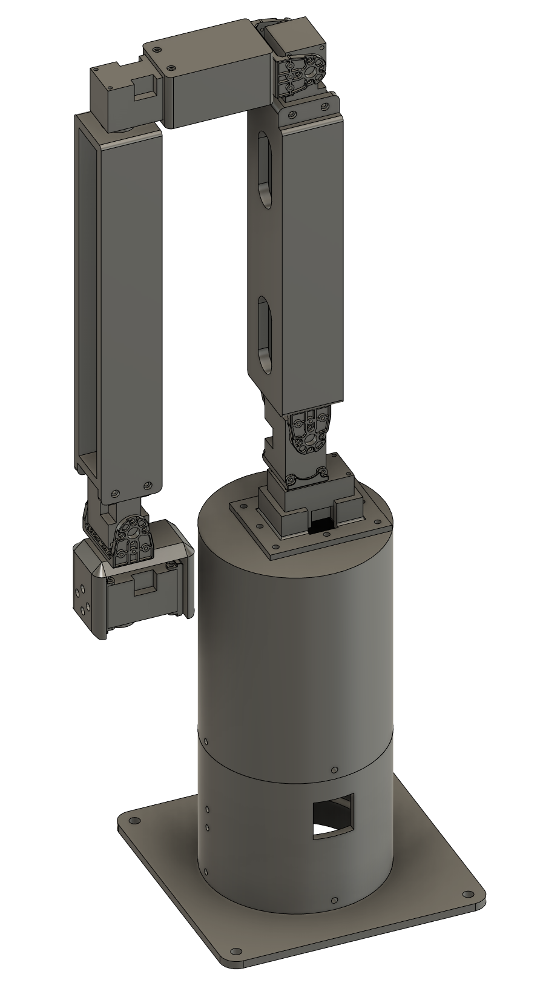
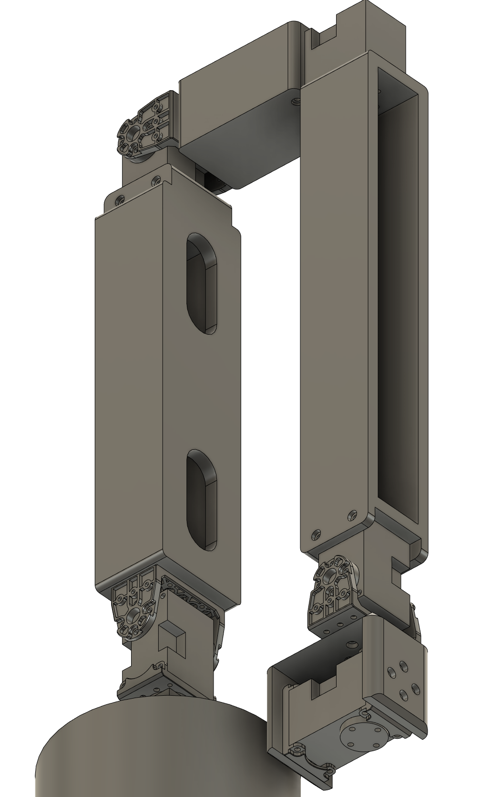

## UFACTORY Lite 6

## BOM
- XL330-M288-T x6 (ROBOTIS https://emanual.robotis.com/docs/en/dxl/x/xl330-m288/)
- FPX330-H101 x3 (ROBOTIS)
- FPX330-S102 x3 (ROBOTIS)

- M2x6mm bolt x 20pcs
- M2 nuts x 20pcs
- U2D2 (ROBOTIS https://emanual.robotis.com/docs/en/parts/interface/u2d2/)
- U2D2 PHB Set (ROBOTIS https://emanual.robotis.com/docs/en/parts/interface/u2d2_power_hub/)

These are included in XL330 servo and FPX330 series:
- M2x6mm screw x a lot
- M2x8mm screw x a lot

## 3D printed parts
- [base.stl](./3dprint_parts/base.stl)
- [L1.stl](./3dprint_parts/L1.stl)
- [L2.stl](./3dprint_parts/L2.stl)
- [L3.stl](./3dprint_parts/L3.stl)
- [L4.stl](./3dprint_parts/L4.stl)

You can also use base.stl from xarm7 instead of base.stl in this lite6 folder: [base.stl](../xarm7/base.stl)

If you want to keep the height of this leader sytem same with Actual Lite 6, prepare these:
- [baseRoll.stl](./3dprint_parts/baseRoll.stl)
- [baseRollExtender.stl](./3dprint_parts/baseRollExtender.stl)
- [baseBottom.stl](./3dprint_parts/baseBottom.stl)

## Assembly instruction
- https://www.youtube.com/watch?v=b4JclmGF2Hk

## Contact
https://twitter.com/EL2031watson
